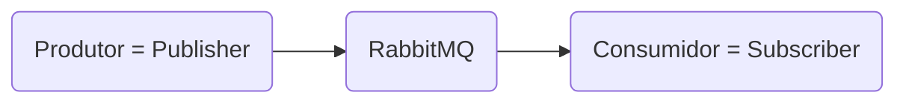

*Disclaimer: Esse texto é fruto do estudo do Curso de RabbitMQ com Java Spring Boot do professor Danilo Caneschi com duração de 2 horas.*

[Acesse o curso no YouTube](https://youtube.com/playlist?list=PL1OeYyl9zqzHDN67rto7KMtezTLmk1N-K)

## Vídeo #1: Conhecendo o RabbitMQ
O RabbitMQ é uma ferramenta incrível e altamente utilizada na arquitetura de microsserviços. O RabbitMQ é um ***message broker***; ou seja, ele é um intermediador de mensagens que trabalha de forma assíncrona. *Open source* e escrito em Erlang, o que permite que o RabbitMQ trabalhe com alta disponibilidade e escalabilidade.


O sistema de mensageria trabalha com um produtor e um consumidor.

O produtor é quem envia a mensagem e o consumidor é quem pega a mensagem do RabbitMQ.

Para entender melhor como o RabbitMQ funciona, podemos usar a seguinte analogia:
1. Imagine uma empresa onde uma pessoa entrega um produto a essa empresa. (Vendedor)
2. A empresa realiza todo o trajeto para entregar esse produto. (Transportadora)
3. E existe uma outra pessoa esperando esse produto. (Cliente)

Antes de entender como é o funcionamento do RabbitMQ,  é importante entender alguns conceitos primeiro.
```
Fila = Queue
Troca = Exchange
Mensagens = Payload
```
As filas são os locais onde as mensagens são armazenadas. É um *buffer* onde você pode definir se as mensagens são armazenadas ou não. Em Erlang é chamado de durável (durable). Uma mensagem durável é armazenada/persistida em disco e uma mensagem não-durável é armazenada em memória enquanto o processo do servidor/RabbitMQ existir.

As mensagens podem ser de qualquer tipo. Exemplo: um texto puro (plain text), um arquivo PDF, uma imagem, um vídeo, etc. **As mensagens são enviadas em bytes para o RabbitMQ.**

Todas as mensagens (*payloads*) passam por uma exchange antes de serem enviadas para as filas. As exchanges são responsáveis por receber as mensagens e, de acordo com os dados que as mensagens contêm, mandar essas mensagens para as filas corretas.

Cada mensagem é enviada com alguns argumentos em seu cabeçalho: qual a *exchange*, qual o nome da fila (*routing key)* e o corpo da mensagem (*body*).

Toda vez que uma fila é criada, ela possui um vínculo com alguma exchange (*binding key*?).

As exchanges podem ser divididas em 5 tipos:
- Default: esta é utilizada sempre que uma mensagem é enviada sem especificar para qual exchange ela deve ser enviada.
- Fanout: esta é utilizada quando você quer mandar as mensagens recebidas pela exchange para todas as filas vinculadas a essa exchange. Ao enviar uma mensagem para uma *exchange* do tipo *fanout* não é necessário especificar uma *routing key* pois isso será ignorado pelo seu comportamento de enviar as mensagens para todas as filas associadas a ela.
- Direct: envia a mensagem diretamente para a exchange e a routing key especificada.
- Topic: similar a Direct, mas a forma de gerar o routing key é diferente. Por exemplo: na exchange do tipo *direct*, você pode colocar como chave de roteamento (routing key) o nome de uma fila; na do tipo *topic* é necessário seguir alguns critérios: o nome da routing key precisa conter palavras e pontos e caracteres especiais como asterísco (\*) e a tralha (#). O asterísco (\*) serve para substituir exatamente uma palavra e a tralha (#) pode substituir zero ou mais palavras.
- Header: nesta exchange você precisa definir alguns atributos no cabeçalho da mensagem para que ele seja checado antes de enviar a mensagem (*payload*) para uma fila específica. Por exemplo: imagine uma mensagem contendo um arquivo de mídia - um PDF, antes de enviar a mensagem em byte contendo o PDF, você precisa informar o ```type```, ```format``` e o ```x-match```. No nosso caso seria:
```
type=file
format=pdf
x-match=all
```
Outro exemplo:
```
type=text
format=log
x-match=any
```
No caso do ```x-match``` existem duas opções para que a mensagem seja direcionada a uma fila: 
```all```: todos os pares chave-valor devem corresponder
```any```: um dos pares chave-valor deve corresponder

A exchange do tipo *header* é muito utilizada para tratamento de arquivos de mídia, onde você define um formato e um tipo de arquivo.

**OBS:** Todas essas exchanges e suas filas suportam balanceamento de carga.

Os consumidores precisam se inscrever numa fila e ficar ouvindo ela. Quando isso acontece, uma conexão é registrada no servidor do RabbitMQ. Assim é possível ter vários consumidores para uma única fila. O próprio RabbitMQ trabalha de forma distribuir as mensagens de forma sequencial e uniforme utilizando o algoritmo ***Round-robin*** para cada consumidor. Dessa forma você consegue ter uma escalabilidade muito alta.

Além disso o RabbitMQ suporta os seguintes protocolos:
- AMQP (o principal)
- STOMP
- MQTT
- HTTP

E também possui bibliotecas para suportar diversas linguagens de programação como: Java, PHP, C#, JavaScript e Python.

Isso permite sua adoção por vários sistemas independente de sua linguagem sem haver perdas na comunicação.

O RabbitMQ é um sistema robusto, processa milhares de filas de mensagens por segundo, é clusterizável.

## Vídeo #2: Instalação do RabbitMQ com Docker
## Vídeo #3: Criando filas no RabbitMQ com Java e Spring Boot
## Vídeo #4: Enviando mensagens ao RabbitMQ utilizando Java e Spring Boot
## Vídeo #5: Consumindo mensagens do RabbitMQ utilizando Java e Spring Boot
## Vídeo #6: Consumindo mensagens do RabbitMQ utilizando Node.js
## Vídeo #7: *Prefetch count* com RabbitMQ e Java e Spring Boot | Aprenda como realizar a configuração
## Vídeo #8: Capturando exceções durante o consumo de mensagens do RabbitMQ com Java e Spring Boot
