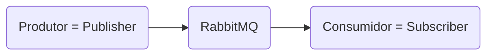
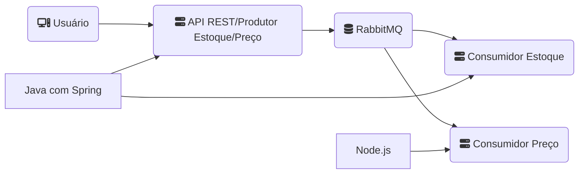

*Disclaimer: Esse texto é fruto do estudo do Curso de RabbitMQ com Java Spring Boot do professor Danilo Caneschi com duração de 2 horas.*

[Acesse o curso no YouTube](https://youtube.com/playlist?list=PL1OeYyl9zqzHDN67rto7KMtezTLmk1N-K)

## Vídeo #1: Conhecendo o RabbitMQ
O RabbitMQ é uma ferramenta incrível e altamente utilizada na arquitetura de microsserviços. O RabbitMQ é um ***message broker***; ou seja, ele é um intermediador de mensagens que trabalha de forma assíncrona. *Open source* e escrito em Erlang, o que permite que o RabbitMQ trabalhe com alta disponibilidade e escalabilidade.


O sistema de mensageria trabalha com um produtor e um consumidor.

O produtor é quem envia a mensagem e o consumidor é quem pega a mensagem do RabbitMQ.

Para entender melhor como o RabbitMQ funciona, podemos usar a seguinte analogia:
1. Imagine uma empresa onde uma pessoa entrega um produto a essa empresa. (Vendedor)
2. A empresa realiza todo o trajeto para entregar esse produto. (Transportadora)
3. E existe uma outra pessoa esperando esse produto. (Cliente)

Antes de entender como é o funcionamento do RabbitMQ,  é importante entender alguns conceitos primeiro.
```
Fila = Queue
Troca = Exchange
Mensagens = Payload
```
As filas são os locais onde as mensagens são armazenadas. É um *buffer* onde você pode definir se as mensagens são armazenadas ou não. Em Erlang é chamado de durável (durable). Uma mensagem durável é armazenada/persistida em disco e uma mensagem não-durável é armazenada em memória enquanto o processo do servidor/RabbitMQ existir.

As mensagens podem ser de qualquer tipo. Exemplo: um texto puro (plain text), um arquivo PDF, uma imagem, um vídeo, etc. **As mensagens são enviadas em bytes para o RabbitMQ.**

Todas as mensagens (*payloads*) passam por uma exchange antes de serem enviadas para as filas. As exchanges são responsáveis por receber as mensagens e, de acordo com os dados que as mensagens contêm, mandar essas mensagens para as filas corretas.

Cada mensagem é enviada com alguns argumentos em seu cabeçalho: qual a *exchange*, qual o nome da fila (*routing key)* e o corpo da mensagem (*body*).

Toda vez que uma fila é criada, ela possui um vínculo com alguma exchange (*binding key*?).

As exchanges podem ser divididas em 5 tipos:
- Default: esta é utilizada sempre que uma mensagem é enviada sem especificar para qual exchange ela deve ser enviada.
- Fanout: esta é utilizada quando você quer mandar as mensagens recebidas pela exchange para todas as filas vinculadas a essa exchange. Ao enviar uma mensagem para uma *exchange* do tipo *fanout* não é necessário especificar uma *routing key* pois isso será ignorado pelo seu comportamento de enviar as mensagens para todas as filas associadas a ela.
- Direct: envia a mensagem diretamente para a exchange e a routing key especificada.
- Topic: similar a Direct, mas a forma de gerar o routing key é diferente. Por exemplo: na exchange do tipo *direct*, você pode colocar como chave de roteamento (routing key) o nome de uma fila; na do tipo *topic* é necessário seguir alguns critérios: o nome da routing key precisa conter palavras e pontos e caracteres especiais como asterísco (\*) e a tralha (#). O asterísco (\*) serve para substituir exatamente uma palavra e a tralha (#) pode substituir zero ou mais palavras.
- Header: nesta exchange você precisa definir alguns atributos no cabeçalho da mensagem para que ele seja checado antes de enviar a mensagem (*payload*) para uma fila específica. Por exemplo: imagine uma mensagem contendo um arquivo de mídia - um PDF, antes de enviar a mensagem em byte contendo o PDF, você precisa informar o ```type```, ```format``` e o ```x-match```. No nosso caso seria:
```
type=file
format=pdf
x-match=all
```
Outro exemplo:
```
type=text
format=log
x-match=any
```
No caso do ```x-match``` existem duas opções para que a mensagem seja direcionada a uma fila: 
```all```: todos os pares chave-valor devem corresponder
```any```: um dos pares chave-valor deve corresponder

A exchange do tipo *header* é muito utilizada para tratamento de arquivos de mídia, onde você define um formato e um tipo de arquivo.

**OBS:** Todas essas exchanges e suas filas suportam balanceamento de carga.

Os consumidores precisam se inscrever numa fila e ficar ouvindo ela. Quando isso acontece, uma conexão é registrada no servidor do RabbitMQ. Assim é possível ter vários consumidores para uma única fila. O próprio RabbitMQ trabalha de forma distribuir as mensagens de forma sequencial e uniforme utilizando o algoritmo ***Round-robin*** para cada consumidor. Dessa forma você consegue ter uma escalabilidade muito alta.

Além disso o RabbitMQ suporta os seguintes protocolos:
- AMQP (o principal)
- STOMP
- MQTT
- HTTP

E também possui bibliotecas para suportar diversas linguagens de programação como: Java, PHP, C#, JavaScript e Python.

Isso permite sua adoção por vários sistemas independente de sua linguagem sem haver perdas na comunicação.

O RabbitMQ é um sistema robusto, processa milhares de filas de mensagens por segundo, é clusterizável.

## Vídeo #2: Instalação do RabbitMQ com Docker
Nesse vídeo vamos aprender a criar um projeto utilizando RabbitMQ, Java com Spring Boot e Node.js.

Vamos desenvolver microsserviços: 1 produtor da mensagem e 2 consumidores (um em Java com Spring e o outro em Node.js)

Antes de mais nada precisamos instalar o RabbitMQ utilizando o Docker.

O Docker é um ferramenta que nos permite reproduzir o ambiente de produção na nossa máquina de desenvolvimento pois ele é um virtualizador do nosso sistema operacional, compartilhando dos mesmos recursos de uma máquina física.

O Docker possui alguns conceitos importantes de serem entendidos:
- Imagem: é onde contém o software que vamos utilizar, por exemplo: uma imagem RabbitMQ.
- Container: são instâncias da aplicação em cima de uma imagem. Por exemplo, criar uma instância do Docker baseado na imagem RabbitMQ.
- Cliente Docker: é o software que nos permite executar linhas de comando do Docker.
- Docker Daemon: é o recurso do Docker que gerencia a estrutura do container, sua criação, distribuição, etc.

Instale o Docker Desktop para Windows.

Quando a gente instala o Docker no Windows, ele vem com uma nova funcionalidade chamada Docker Compose. Com ela nós podemos juntar cada serviço que nós queremos levantar dentro de um arquivo YAML. Vamos utilizar esse arquivo em nosso exemplo.

Crie um arquivo chamado ```docker-compose.yml``` em uma pasta definida para o nosso projeto.

O conteúdo dessa arquivo deve ser o seguinte:
```yml
 1 services:
 2   rabbitmq:
 3     image: rabbitmq:3-management
 4     container_name: rabbitmq
 5     restart: always
 6     ports:
 7       - 5672:5672
 8       - 15672:15672
 9     volumes:
10       - ./dados:/var/lib/rabbitmq/
11     environment:
12       - RABBITMQ_DEFAULT_USER=admin
13       - RABBITMQ_DEFAULT_PASS=123456
```

Vamos explicar o que cada linha significa!
```yml
 1 services:
```
Na primeira linha nós definimos quais são os serviços que nós vamos utilizar através de um bloco chamado ```services```. Os blocos possuem ```:``` depois da palavra e o seu conteúdo é apresentado nas linhas seguintes com indentação.

Dentro do bloco de serviços vamos adicionar o nome do nosso serviço do RabbitMQ:
```yml
 2   rabbitmq:
```
E dentro do bloco do serviço RabbitMQ, adicionamos o nome da imagem e sua versão. Caso a versão não seja passada, a versão mais recente será a escolhida.
```yml
 3     image: rabbitmq:3-management
```
_ As versões podem ser consultadas no site do Docker Hub nos detalhes da imagem oficial do RabbitMQ._

Ainda dentro do bloco de RabbitMQ, vamos definir o nome do nosso container. Pode ser qualquer nome, mas vamos usar ```rabbitmq``` para simplificar o entendimento.
```yml
 4     container_name: rabbitmq
```
Agora vamos adicionar um atributo chamado ```restart``` que serve para reiniciar automaticamente nosso serviço caso o nosso computador/máquina seja reiniciado.
```yml
 5     restart: always
```
Agora vamos definir as portas de comunicação do RabbitMQ. A primeira porta padrão do RabbitMQ é a ```5672```, que é a porta do nosso servidor AMQP, e a outra porta padrão é a ```15672``` que nos apresenta um *dashboard* ou painel administrativo web.
```yml
 6     ports:
 7       - 5672:5672
 8       - 15672:15672
```
Note que os números das portas se repetem porque o número do lado esquerdo dos dois pontos é a porta que seja exposta na nossa máquina e a do lado direito é a porta de comunicação dentro do container. Dessa forma podemos definir outros números de portas tanto para a comunicação da nossa máquina quanto dentro do container. Para simplificar nossa configuração vamos repetir os números das portas dos dois lados.

Outro ponto importante é o mapeamento dos dados, onde as filas e as mensagens do RabbitMQ serão armazenados. Vamos definir um atributo ```volume``` e indicar em qual pasta nós vamos salvar essas informações.

Vamos criar uma pasta dentro da pasta raiz do projeto chamada ```dados```. Os dados do RabbitMQ serão persistidos dentro dessa pasta. É importante definir essa pasta pois caso contrário os dados serão armazenados dentro de um container e quando esse container for finalizado, todos os dados dentro dele serão perdidos. Definindo esse armazenamento na nossa máquina física, podemos manter um backup e posteriormente, se necessário, realizar recuperações dos dados.

Seguindo o mesmo esquema, vamos definir o diretório do container a direito dos dois pontos. Essa informação se encontra na página da imagem oficil do RabbitMQ no site do Docker Hub.

```yml
 9     volumes:
10       - ./dados:/var/lib/rabbitmq/
```
E, por último, vamos definir algumas variáveis de ambiente (usuário e senha) para poder conectar o RabbitMQ. Essa informação também se encontra na página da imagem oficil do RabbitMQ no site do Docker Hub.

```yml
11     environment:
12       - RABBITMQ_DEFAULT_USER=admin
13       - RABBITMQ_DEFAULT_PASS=123456
```

Pronto! Nosso arquivo ```docker-compose``` está criado!

Agora vamos acessar a pasta do projeto pelo terminal (CMD) para executar esse arquivo. Execute o comando:

```
docker-compose up -d
```

O comando ```up``` vai criar um container, uma instância da imagem do RabbitMQ em um container. Ele vai verificar se a imagem especificada existe na nossa máquina, caso não existe ele vai baixar do repositório do Docker Hub e depois vai criar a instância da imagem.

A opção ```-d``` (*detach* ou desacoplar) serve para não entrarmos no console do container Docker, deixando o terminal livre para receber outros comandos.

***OBS: Caso não seja especificado, o nome da instância vai ser o nome da pasta que abriga o arquivo docker-compose!***

Vamos conhecer alguns outros comandos do Docker:

```
docker images
```
Esse comando lista todas as imagens disponíveis na nossa máquina.

Para ver quais instâncias estão rodando/em execução no Docker, usamos o comando:

```
docker ps
```
Com a instância rodando, podemos acessar o painel de controle do RabbitMQ através do porta 15672 no localhost. Cole na barra de endereço do seu navegador:

```
localhost:15672
```
Use as credenciais definidas no arquivo Docker Compose para acessar o painel.

No painel administrativo do RabbitMQ, podemos ver:
- conexões
- canais
- exchanges
- filas
- consumidores

OBS: As exchanges-padrão já vem criadas!

Ainda falando de Docker, para parar uma instância/container, use o comando:
```
docker stop <id>
```
Para ver o id das instância em execução, use o ```docker ps```.

Outra opção válida é através do comando:
```
docker-compose down
```
Mas esse comando deve ser executado a partir da pasta onde o arquivo Docker Compose se encontra!

Agora vamos criar o projeto Java, utilizando o IntelliJ ou o STS Suite. A versão Ultimate do IntelliJ possui um assistente embutido para criar projetos com Spring, caso não possua, use o site [Spring Initializr](https://start.spring.io/) para construir o projeto. No nosso caso vamos usar o Maven como gerenciador de dependências.

Vamos deletar a pacote de testes pois não vamos implementar testes nesse curso.

Vamos adicionar a dependência do RabbitMQ no arquivo ```pom.xml```:
```
<dependency>
  <groupId>org.springframework.amqp</groupId>
  <artifactId>spring-rabbit</artifactId>
</dependency>
```

Feito isso, vamos configurar as propriedades da aplicação/projeto no arquivo ```application.properties``` com as seguintes propriedades:
```
spring.rabbitmq.host=localhost
spring.rabbitmq.port=5672
spring.rabbitmq.username=admin
spring.rabbitmq.password=123456
```

Como esse primeiro projeto é a nossa API, que vai receber as requisições dos clientes, vamos precisar de um servidor para rodar nossa API. O Spring já possui um servidor embarcado para Java que é o Tomcat. Vamos adicionar a seguinte dependência:
```
<dependency>
  <groupId>org.springframework.boot</groupId>
  <artifactId>spring-boot-starter-web</artifactId>
</dependency>
```

## Vídeo #3: Criando filas no RabbitMQ com Java e Spring Boot

Nesse vídeo construir nossa API e criar as filas no RabbitMQ.

## Vídeo #4: Enviando mensagens ao RabbitMQ utilizando Java e Spring Boot
## Vídeo #5: Consumindo mensagens do RabbitMQ utilizando Java e Spring Boot
## Vídeo #6: Consumindo mensagens do RabbitMQ utilizando Node.js
## Vídeo #7: *Prefetch count* com RabbitMQ e Java e Spring Boot | Aprenda como realizar a configuração
## Vídeo #8: Capturando exceções durante o consumo de mensagens do RabbitMQ com Java e Spring Boot
